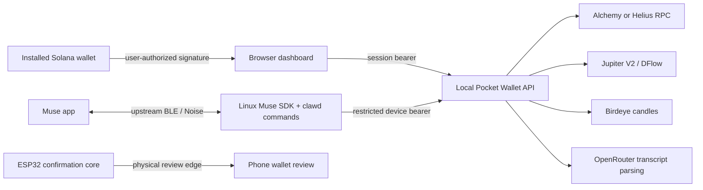

# Pocket Wallet architecture

## What runs

`api/server.mjs` serves an Express API on loopback port 8787 and the built
`dist/` dashboard. During development, Vite on port 5173 proxies `/api`.
This repository does **not** install routes into the live Musebook Worker.
The earlier Worker route design was a proposal, not an existing deployment.

The browser registers Mobile Wallet Standard early. Wallet Standard wallet
discovery drives connection and message/transaction signing. Seeker Connect
is registered only when an explicitly configured relay domain exists. No
relay terms are accepted automatically.

`api/app.mjs` stores nonce challenges, sessions, quotes and intents in bounded,
expiring process-local maps. Challenges bind wallet, domain, origin, mainnet,
nonce and expiry; Ed25519 verification consumes them once. Sessions last one
hour and restart revokes them. Tokens stay in browser memory, or in a 0600
companion config. DELETE session revokes a token; changing wallet clears the
browser session and pending review.

`api/providers.mjs` holds all provider credentials. RPC precedence is
`RPC_URL`, `HELIUS_RPC_URL`, `ALCHEMY_API_KEY`, then `HELIUS_API_KEY`.
Balances query both SPL Token programs. Charts use Birdeye candles and emit
baseline JPEG by default, compatible with the upstream Muse image fetcher;
PNG and big-endian RGB565 are also available.

## Transaction flow

1. A wallet-authenticated quote request fixes input/output mints, integer
   input amount, slippage and venue. The browser currently supports SOL/USDC.
2. Jupiter V2 or DFlow returns the assembled transaction. The server verifies
   returned mints and input amount, then stores it for 30 seconds.
3. The browser shows estimated and minimum output, slippage and provider fee
   information. Unknown network fees are explicitly wallet estimates.
4. Preparing an intent consumes the quote and returns the same transaction.
5. A separate user click invokes the installed wallet's signTransaction.
6. The API verifies the serialized transaction message is unchanged and the
   authenticated wallet's Ed25519 signature is valid. It locks the intent
   before sending, including when the provider result is ambiguous.
7. Jupiter submits through `/swap/v2/execute`; synchronous DFlow submits
   through RPC with preflight. RPC status polling distinguishes submission,
   on-chain failure and confirmation. The user can inspect an Explorer receipt.

There is no local wallet key storage or autonomous spend mode. Device tokens
are unable to submit. A physical press never substitutes for wallet approval.

## Muse and firmware

`scripts/prepare-linux-sdk.py` copies the supplied Linux SDK into a disposable
build directory and adds command specs and dispatch in its executor. Commands
run through the upstream unprivileged child-process path. The upstream
BLE/Noise code is not rewritten. Its 137 tests pass with the extension.

`firmware/components/pocket_wallet` is a portable ESP-IDF component implementing
bounded terms, a maximum ten-second physical-review window, local physical
edges, expiry and cancellation. The board pin-map comes from Waveshare's vendor
reference. Full LCD/touch integration, firmware linking and flashing remain
pending; this component alone does not create a functioning handheld.

## Deployment requirements

For remote phones/Pis, expose the API and built dashboard on the **same HTTPS
origin**, set `APP_ORIGIN` to it and keep provider secrets in server environment.
A reverse proxy must forward to loopback 8787. Do not expose Vite as production.
Process-local auth/intent state supports one process; multiple replicas need a
shared store and atomic consumption. Hardware pairing and Android wallet
interaction need real-device checks before a release.
